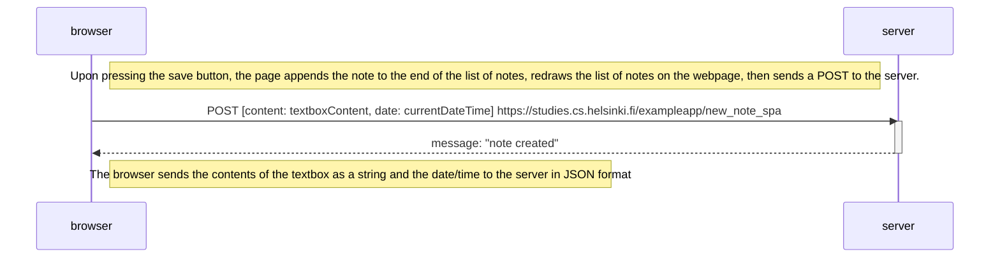

Solution for Full Stack Open Exercise 0.6: https://fullstackopen.com/en/part0/fundamentals_of_web_apps#exercises-0-1-0-6

This exercise asks for a sequence diagram "depicting the situation where the user creates a new note using the single-page version of the app." The single page version is available at https://studies.cs.helsinki.fi/exampleapp/spa.

Sequence diagram for Exercise 0.6 follows

